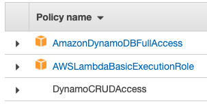
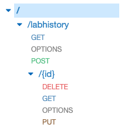

# Serverless AWS Lambda

This project was generated with [Angular CLI](https://github.com/angular/angular-cli) version 8.3.26.

## Development server

Run `ng serve` for a dev server. Navigate to `http://localhost:4200/`. The app will automatically reload if you change any of the source files.

## Technologies used
- [AWS Lambda](https://aws.amazon.com/lambda/) for running code without provisioning servers
- [AWS API Gateway](https://aws.amazon.com/api-gateway/) for Serverless API creation & management
- [AWS Identity and Access Management (IAM)](https://aws.amazon.com/iam/) for creating a role for the Lambda functions we will build
- [AWS DynamoDB](https://aws.amazon.com/dynamodb/) for a managed NoSQL database
- [AWS S3](https://aws.amazon.com/s3/) for an object storage service to host our client application as a static website

## S3 bucket policy

For the browser to download objects from the S3 bucket, the bucket and it's objects need to be public so they can be downloaded without authentication.

```json
{
    "Version": "2008-10-17",
    "Id": "Policy1397495964002",
    "Statement": [
        {
            "Sid": "Stmt123",
            "Effect": "Allow",
            "Principal": {
                "AWS": "*"
            },
            "Action": "s3:GetObject",
            "Resource": "arn:aws:s3:::myBucketName/*"
        }
    ]
}
```

## IAM role policies



## API Gateway config


